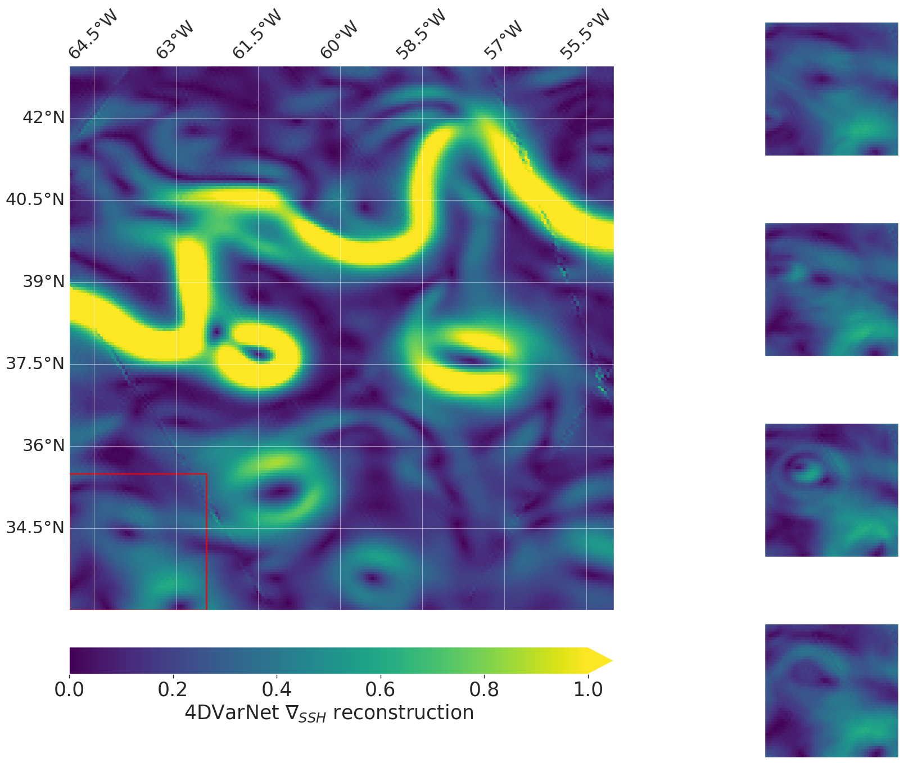
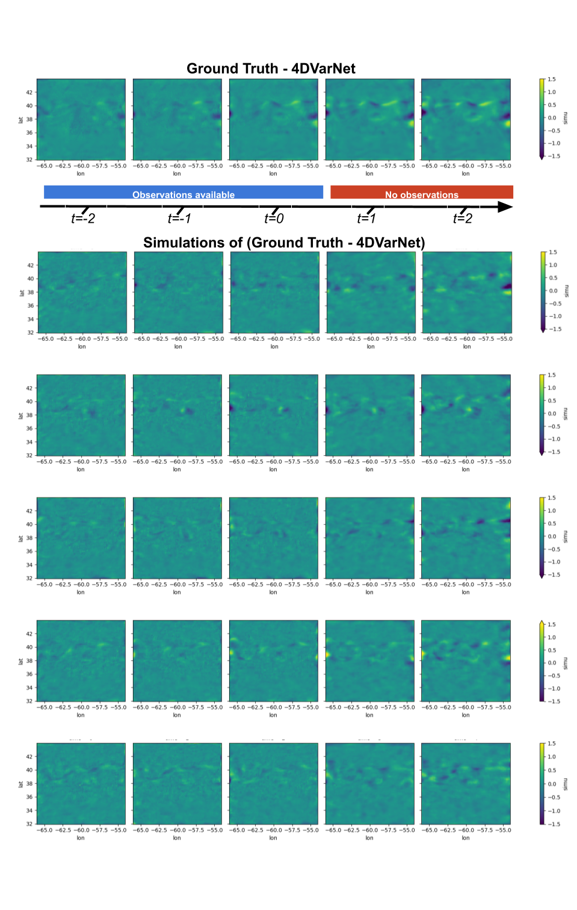

# 4DVarNet

## Prerequisite
- git
- conda

## Install
### Install project dependencies
```
git clone https://github.com/CIA-Oceanix/4dvarnet-starter.git
cd 4dvarnet-starter
conda install -c conda-forge mamba
conda create -n 4dvarnet-starter
conda activate 4dvarnet-starter
mamba env update -f environment.yaml
```

### Download example data
From the directory
```
wget https://s3.eu-central-1.wasabisys.com/sla-data-registry/6d/206c6be2dfe0edf1a53c29029ed239 -O data/natl_gf_w_5nadirs.nc
```

## Run
The model uses hydra see [#useful-links]
```
python main.py xp=base 
```
## Saved weights:

### Gulfstream training
A bigger model has been trained using the command

```
python main.py xp=base +params=bigger_model 
```

You can find pre-trained weights [here](https://s3.eu-central-1.wasabisys.com/melody/quentin_cloud/starter_big_mod_07a265.ckpt)

The test metrics of this model are ([see here for the details])(https://github.com/ocean-data-challenges/2020a_SSH_mapping_NATL60):

|          |   OSSE metrics |
|:---------|---------------:|
| RMSE (m) |      0.0211406 |
| λx       |      0.716     |
| λt       |      4.681     |
| μ        |      0.96362   |
| σ        |      0.00544   |

Animation:


## Stochastic extensions

We build here a stochastic extension of the 4DVarNet framework by replacing the regularization term of the variational cost with a stochastic component inherited either from analog or SPDE-based framework to provide a generative feature associated to 4DVarNet.

### Analog-based UQ


### SPDE-based generative modeling




## Useful links:
- [Hydra documentation](https://hydra.cc/docs/intro/)
- [Pytorch lightning documentation](https://pytorch-lightning.readthedocs.io/en/stable/index.html#get-started)
- 4DVarNet papers:
        - Beauchamp, M., Desassis, N., Johnson, J. E., Benaichouche, S., Tandeo, P., & Fablet, R. (2024). SPDE priors for uncertainty quantification of end-to-end neural data assimilation schemes. https://arxiv.org/abs/2402.01855
        - Beauchamp M., Febvre Q., and Fablet R. Ensemble-based 4DvarNet uncertainty quantification for the reconstruction of sea surface height dynamics. Environmental Data Science, 2:e18, 2023a. doi: 10.1017/eds.2023.19.
        - Beauchamp, M., Febvre Q., Georgenthum H., and Fablet R. 4dvarnet-SSH: End-to-end learning of variational interpolation schemes for nadir and wide-swath satellite altimetry. GeoscientificModel Development, 16(8):2119–2147, 2023b. doi: 10.5194/gmd-16-2119-2023. URL https://gmd.copernicus.org/articles/16/2119/2023/
	- Fablet, R.; Chapron, B.; Drumetz, L.; Mmin, E.; Pannekoucke, O.; Rousseau, F. Learning Variational Data Assimilation Models and Solvers. Journal of Advances in Modeling Earth Systems n/a (n/a), e2021MS002572. https://doi.org/10.1029/2021MS002572.

